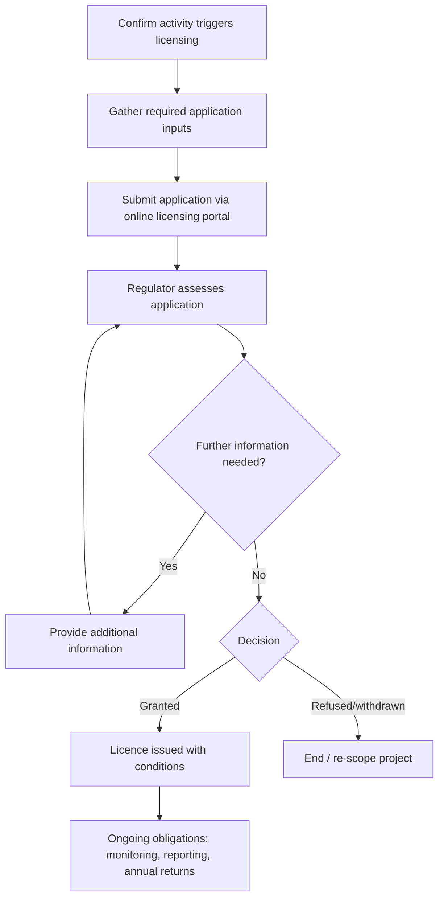

# Resource index of the NSW EPA website for environmental regulation

## Executive summary

This report indexes the key NSW EPA web resources for **environmental regulation** with an **unspecified sector** (i.e., cross‑sector orientation). The NSW EPA site is structured so that most “regulator‑facing” material sits under **Licensing and regulation** (frameworks, licences, public registers, enforcement guidance, and consultation updates), while “topic/environment” material (air, waste, water, chemicals, litter, etc.) sits under **Your environment** and includes technical guidance, research outputs, and some datasets. citeturn2view0turn4view4turn14view1

For **regulatory frameworks and decision-making**, the site points users to a **Regulatory framework** page and a downloadable **Regulatory Policy** (describing regulatory tools and decision factors). The site also publishes a current **Prosecution Guidelines** document, alongside an operational “how-to” **Powers and Notices Guideline** for authorised/enforcement officers (including templates). citeturn14view1turn10view0turn9view0turn36view3turn37view0

For **licensing**, the central workflow is via **eConnect EPA**, which supports online application/management for Environment Protection, Radiation, Dangerous Goods, and Pesticides licences; and supports submissions such as annual returns and certain changes (vary/transfer/surrender, contact details). The eConnect page explicitly lists the information required for an Environment Protection licence application (applicant details, proposed licence type, development consent/approvals, scheduled/non‑scheduled activities, and supporting/spatial information). citeturn38view0

For **monitoring data**, the site uses a mixed model: (1) regulated entities must publish certain **pollution monitoring data** under statutory requirements, with EPA‑issued written requirements and audit findings published as PDFs; (2) regulatory datasets (licences, notices, loads) are available via public registers and related downloads; and (3) broader environmental datasets increasingly sit on NSW Government platforms such as **entity["organization","SEED","nsw environmental data portal"]**, where users can explore dashboards and access underlying datasets. citeturn23view0turn24view0turn15view0turn42view2

For **enforcement transparency**, the site highlights public registers (including a POEO public register that includes licences, applications, notices, penalty notices, convictions, civil results, and more), a **Public warnings** area, and frequent enforcement-related media releases since 2023 (e.g., notices, fines, enforceable undertakings, and incident investigations). citeturn15view0turn34view0turn31view0turn43view0turn43view1turn43view2

## Site map and wayfinding

The EPA site’s top-level navigation (as represented by its published sitemap and global menus) can be grouped into the following main areas. The most relevant paths for regulation/licensing/compliance are highlighted. citeturn2view0turn39view0turn31view0turn28view0turn30view0

### Navigation map

**Your environment**  
Topic hubs (e.g., air, waste, water, chemicals, litter) hosting guidance, research outputs, and some datasets; includes research pages such as the Broadscale Microplastic Assessment. citeturn41view0

**Licensing and regulation**  
The regulator’s core library: licensing (including eConnect), regulation framework/policy, legislation/compliance pages, public registers, and enforcement officer resources. citeturn39view0turn14view1turn7view3turn15view0turn36view3

**Reporting and incidents**  
Public reporting pathways (e.g., report pollution), and incident management information, including online reporting and Environment Line contact guidance. citeturn28view0turn29view0

**Newsroom and Media centre**  
EPA and Ministerial releases from the beginning of 2023, plus **Public warnings** and media contact points. citeturn31view0turn34view0turn30view2

**About us / Contact us**  
General contacts, Environment Line, complaints/feedback, and media contact details. citeturn30view0turn29view0turn27view0turn26view0

### Where to find specific regulatory needs quickly

| Regulatory need                                                                | “Best first stop” on the site                                                                                                                                                                                                                         | Notes on what you’ll find                                                                                                                                          |
| ------------------------------------------------------------------------------ | ----------------------------------------------------------------------------------------------------------------------------------------------------------------------------------------------------------------------------------------------------- | ------------------------------------------------------------------------------------------------------------------------------------------------------------------ |
| Regulatory frameworks (how the regulator approaches decisions)                 | `https://www.epa.nsw.gov.au/Licensing-and-Regulation/Regulation` citeturn14view1                                                                                                                                                                   | Gateway to Regulatory framework and Regulatory Policy. citeturn14view1turn10view0                                                                              |
| Licensing entry point (unspecified sector)                                     | `https://www.epa.nsw.gov.au/Licensing-and-Regulation/Licensing` citeturn4view1                                                                                                                                                                     | Launchpad for licence types and licensing reforms. citeturn39view0                                                                                              |
| Licence application process (online portal)                                    | `https://www.epa.nsw.gov.au/Licensing-and-Regulation/Licensing/econnect-epa` citeturn38view0                                                                                                                                                       | Apply/manage licences and submit annual returns; includes Environment Protection licence application data requirements and direct portal links. citeturn38view0 |
| Compliance guidance (officer powers, notices, prosecution approach)            | `https://www.epa.nsw.gov.au/Licensing-and-Regulation/Authorised-Officers-and-Enforcement-Officers/Powers-and-notices-guideline` citeturn36view3 and `https://www.epa.nsw.gov.au/Publications/legislation/Prosecution-Guidelines` citeturn8view0 | Practical enforcement tools (notices/templates) and prosecution decision principles. citeturn37view0turn9view0                                                 |
| Enforcement records (licences, notices, penalties, convictions, civil results) | `https://www.epa.nsw.gov.au/Licensing-and-Regulation/Public-registers/about-prpoeo` citeturn15view0                                                                                                                                                | Explains the POEO public register contents; links to search tools and downloadable lists. citeturn15view0                                                       |
| Monitoring data publication requirements for licensees                         | `https://www.epa.nsw.gov.au/Licensing-and-Regulation/Licensing/Environment-protection-licences/Licensing-under-POEO-Act-1997/publishing-and-providing-pollution-monitoring-data` citeturn23view0                                                   | Statutory duty summary + EPA “Requirements…” PDF and audit summary. citeturn23view0turn24view0turn24view1                                                     |
| Consultations and regulatory updates (index)                                   | `https://www.epa.nsw.gov.au/Licensing-and-Regulation/Updates` citeturn39view0                                                                                                                                                                      | Rolling table of consultations/updates (recent first), with links to consultation hubs and key documents. citeturn39view0                                       |
| News and alerts (including enforcement announcements)                          | `https://www.epa.nsw.gov.au/Newsroom` citeturn31view0 and `https://www.epa.nsw.gov.au/Newsroom/public-warnings` citeturn34view0                                                                                                                 | Media releases since 2023; separate public warnings page with statutory basis and current warnings. citeturn31view0turn34view0                                 |

## Key regulatory frameworks, licensing, and compliance guidance

### Regulatory framework components

The **Regulation** landing page positions the EPA as the primary environmental regulator and links to (1) a **Regulatory framework** (describing “why and how we regulate” and elements of the framework) and (2) a **Regulatory Policy** (explaining how regulatory decisions are made and describing regulatory tools/actions). citeturn14view1turn10view0

Two “anchor” publications sit underneath this structure:

- **Regulatory Policy (PDF)**, presented as sitting “under the Regulatory Framework”, and framed as the place to understand regulatory tools/actions and decision factors. citeturn10view0
- **Prosecution Guidelines (PDF)**, explicitly described as setting out factors for deciding whether/how/where to prosecute offences under administered legislation. citeturn8view0turn9view0

### Licensing workflow and required application information

For an **Environment Protection licence** (sector unspecified), the EPA’s online licensing portal **eConnect EPA** is the key starting point. It is used to apply online, manage licences, and submit annual returns. citeturn38view0

Critically, eConnect EPA specifies that an Environment Protection licence application must supply:

- applicant details
- proposed licence type
- relevant development consent information (including approval documents)
- scheduled or non-scheduled activities proposed
- spatial information and other required documentation. citeturn38view0

### Mermaids for process understanding

#### Licence application flow for an Environment Protection licence (high-level)



This flow reflects the EPA’s stated reliance on eConnect for application and its listed information requirements, and the portal’s ongoing functions for annual returns and licence management. citeturn38view0

#### Enforcement and regulatory response (high-level)

```mermaid
flowchart TD
  A[Complaint / incident / inspection triggers inquiry] --> B[Initial assessment and evidence gathering]
  B --> C{Regulatory response selection}
  C --> D[Notices (e.g., clean-up / prevention / info requests)]
  C --> E[Penalty notice or other administrative action]
  C --> F[Enforceable undertaking option]
  C --> G[Prosecution or civil proceedings]
  D --> H[Compliance follow-up / escalation if needed]
  E --> H
  F --> H
  G --> H
  H --> I[Public transparency: registers, media releases, public warnings (case-dependent)]
```

This reflects the EPA’s published emphasis on consistent lawful use of powers/notices and its published prosecution decision framework, alongside public-facing registers and public warnings mechanisms. citeturn37view0turn9view0turn15view0turn34view0

### Comparative table of core primary documents (cross-sector emphasis)

The table below prioritises **downloadable** primary documents and closely-related primary pages most relevant when you do not yet know your sector or licence type.

| Priority | Document                                                                                                         | Type                         | What it is used for                                                                                                                                                           | Direct URL                                                                                                                                       |
| -------: | ---------------------------------------------------------------------------------------------------------------- | ---------------------------- | ----------------------------------------------------------------------------------------------------------------------------------------------------------------------------- | ------------------------------------------------------------------------------------------------------------------------------------------------ |
|     High | Regulatory Policy (1 Oct 2024)                                                                                   | Policy (PDF)                 | Explains how regulatory decisions are made and describes regulatory tools and actions. citeturn10view0                                                                     | `https://www.epa.nsw.gov.au/sites/default/files/24p4550-regulatory-policy.pdf` citeturn10view0                                                |
|     High | Prosecution Guidelines (Mar 2025)                                                                                | Guidance (PDF)               | Factors considered in decisions to prosecute and how prosecutions are approached under administered legislation. citeturn8view0turn9view0                                 | `https://www.epa.nsw.gov.au/sites/default/files/2025-03/25p4580-prosecution-guidelines_0.pdf` citeturn9view0                                  |
|     High | Powers and Notices Guideline for Authorised Officers and Enforcement Officers (updated Dec 2024; published 2025) | Operational guideline (PDF)  | Practical guidance on powers, notices, penalty notices, prosecutions, enforceable undertakings; supports consistent lawful enforcement. citeturn36view3turn37view0        | `https://www.epa.nsw.gov.au/sites/default/files/2025-10/22p4272-powers-and-notices-guideline-dec-2024.pdf` citeturn37view0                    |
|     High | Guide to Licensing                                                                                               | Guidance (PDF)               | Primary plain-English licensing guide referenced across licensing and load-based licensing pages. citeturn17view0turn38view0                                              | `https://www.epa.nsw.gov.au/sites/default/files/2023-02/guide-to-licensing-230075.pdf` citeturn0search31turn38view0                          |
|     High | Requirements for publishing pollution monitoring data (Oct 2013)                                                 | Statutory requirements (PDF) | Written requirements licensees must follow to publish/provide monitoring results; includes instructions for licensees with/without websites. citeturn23view0turn24view0   | `https://www.epa.nsw.gov.au/sites/default/files/130742reqpubpmdata.pdf` citeturn24view0                                                       |
|     High | Environment Compliance Report: Requirements for Publishing Pollution Monitoring Data                             | Audit summary (PDF)          | Summarises EPA audits of whether licensees are publishing monitoring data as required. citeturn23view0turn24view1                                                         | `https://www.epa.nsw.gov.au/sites/default/files/140296ecrpoll.pdf` citeturn24view1                                                            |
|   Medium | Load Calculation Protocol (June 2009)                                                                            | Technical protocol (PDF)     | Methods licensees use to calculate assessable pollutant loads (load-based licensing), linked to the licence fee scheme. citeturn19view1turn20view0                        | `https://www.epa.nsw.gov.au/sites/default/files/09211loadcalcprot.pdf` citeturn20view0                                                        |
|   Medium | Load Calculation Protocol addendum notice (20 Jun 2014)                                                          | Gazette addendum (PDF)       | Incorporates coal seam gas assessment/production activities into the protocol framework. citeturn19view1turn20view1                                                       | `https://www.epa.nsw.gov.au/sites/default/files/140481lblprotaddend.pdf` citeturn20view1                                                      |
|   Medium | Load Calculation Protocol addendum notice (27 Mar 2015)                                                          | Gazette addendum (PDF)       | Incorporates petroleum exploration/assessment/production activities into the protocol framework. citeturn19view1turn20view2                                               | `https://www.epa.nsw.gov.au/sites/default/files/150152-addendum-load-calculation.pdf` citeturn20view2                                         |
|   Medium | Draft s 96 prevention notice template                                                                            | Template (PDF)               | Example/template for a prevention notice instrument under POEO powers and notices materials. citeturn36view3turn37view2                                                   | `https://www.epa.nsw.gov.au/sites/default/files/24j1018-section-96-prevention-notice-template.pdf` citeturn37view2                            |
|     High | Climate Change Licensee Requirements (Mar 2026)                                                                  | Regulatory plan (PDF)        | Sets pathway for climate-related requirements for environment protection licensees (phased approach). citeturn39view0turn40view0                                          | `https://www.epa.nsw.gov.au/sites/default/files/2026-03/Climate%20Change%20Licensee%20Requirements.pdf` citeturn40view0                       |
|   Medium | Emissions reporting and climate change mitigation/adaptation plans guidance (Mar 2026)                           | Guidance (PDF)               | Companion guidance to support emissions reporting and climate plans for licensees. citeturn39view0turn40view1                                                             | `https://www.epa.nsw.gov.au/sites/default/files/2026-03/Emissions%20reporting%20and%20CCMAP%20guidance.pdf` citeturn40view1                   |
|   Medium | Greenhouse gas mitigation guide for NSW coal mines (Mar 2026)                                                    | Sector technical guide (PDF) | Coal-specific mitigation guidance (included here as a clear example of sector guidance published alongside cross-sector climate requirements). citeturn39view0turn40view2 | `https://www.epa.nsw.gov.au/sites/default/files/2026-03/Greenhouse%20gas%20mitigation%20guide%20for%20NSW%20coal%20mines.pdf` citeturn40view2 |

**Notes on the “Regulatory Policy” direct PDF link:** the EPA publication page lists the file name `24p4550-regulatory-policy.pdf` and provides a download link; automated retrieval may fail for some clients due to file size/handling, but the URL above reflects the hosted path referenced by the site. citeturn10view0

## Monitoring data and datasets

### Where monitoring-related information is hosted

The EPA website supports monitoring data access through three distinct channels:

1. **Licensee-published pollution monitoring data**: the EPA summarises statutory duties and provides its written requirements (PDF) and audit findings summary (PDF). This is “distributed” data (published on licensee sites or provided on request), but the EPA’s requirement documents are central references. citeturn23view0turn24view0turn24view1

2. **Regulatory datasets via public registers**: the POEO public register contains licences, applications, notices, penalty notices, convictions and civil proceeding outcomes, and more, and offers search tools plus downloadable lists (licences and unlicensed EPA‑regulated premises). citeturn15view0

3. **Environmental datasets via NSW Government data services**: for example, the Broadscale Microplastic Assessment is published with a technical report, report card, and an interactive dashboard on **entity["organization","SEED","nsw environmental data portal"]** with links to access the data. citeturn41view0turn42view2

### Dataset comparison table

| Dataset / data product                                     | What it covers                                                                                                                                                                      | Hosting / access mode                                                          | How to access/download                                                                                                                  | Link                                                                                                                                                                                                                                                                                                                      |
| ---------------------------------------------------------- | ----------------------------------------------------------------------------------------------------------------------------------------------------------------------------------- | ------------------------------------------------------------------------------ | --------------------------------------------------------------------------------------------------------------------------------------- | ------------------------------------------------------------------------------------------------------------------------------------------------------------------------------------------------------------------------------------------------------------------------------------------------------------------------- |
| POEO public register (search tools)                        | Licences, applications, environment protection/noise control notices, penalty notices, convictions and civil results, exemptions and more (as described by EPA). citeturn15view0 | Web apps (EPA subdomains) + explanatory page                                   | Start at “About the public register”, then use linked search tools. citeturn15view0                                                  | `https://www.epa.nsw.gov.au/Licensing-and-Regulation/Public-registers/about-prpoeo` citeturn15view0                                                                                                                                                                                                                    |
| Licence lists (download)                                   | EPA notes downloadable lists of POEO licences and unlicensed premises regulated by EPA (as zip/Excel lists). citeturn15view0                                                     | EPA site downloads                                                             | Use the links from the public register page (licences; unlicensed premises). citeturn15view0turn15view1turn16view6                 | `https://www.epa.nsw.gov.au/Licensing-and-Regulation/Public-registers/about-prpoeo/list-of-licences` citeturn15view1 and `https://www.epa.nsw.gov.au/Licensing-and-Regulation/Public-registers/about-prpoeo/unlicensed-premises-epa-reg` citeturn16view6                                                            |
| POEO licence list file (direct download)                   | Spreadsheet list of licensed activities (linked from the “List of licences” page). citeturn15view1                                                                               | Direct file download                                                           | Download directly as a spreadsheet file.                                                                                                | `https://www.epa.nsw.gov.au/sites/default/files/2025-02/poeolicencelist_18_2_2025.xls` citeturn15view1turn16view0                                                                                                                                                                                                     |
| Load-based licensing (LBL): protocol + contextual guidance | How pollutant loads/fees are calculated; context and cautions for interpreting load/fee data. citeturn17view0turn19view1                                                        | EPA pages + PDFs                                                               | Read “Using LBL data” for interpretation; use Load Calculation Protocol PDF for methodology. citeturn17view0turn19view1turn20view0 | `https://www.epa.nsw.gov.au/Licensing-and-Regulation/Public-registers/about-prpoeo/ninprpoeo/using-lbl-data` citeturn17view0 and `https://www.epa.nsw.gov.au/sites/default/files/09211loadcalcprot.pdf` citeturn20view0                                                                                             |
| Broadscale Microplastic Assessment (BMA) reports           | Statewide microplastic assessment outputs (technical report and report card). citeturn41view0                                                                                    | EPA downloads                                                                  | Download the report card and technical report from the BMA page. citeturn41view0                                                     | `https://www.epa.nsw.gov.au/sites/default/files/2026-03/broadscale-microplastics-report-card-260012.pdf` citeturn41view0turn42view1 and `https://www.epa.nsw.gov.au/sites/default/files/2026-03/broadscale-microplastic-assessment-coastal-waterways-technical-report-2026-250414.pdf` citeturn41view0turn42view0 |
| Broadscale Microplastic Assessment dashboard + data        | Interactive dashboard summarising statewide microplastic results and linking to data access. citeturn42view2                                                                     | **entity["organization","SEED","nsw environmental data portal"]** dashboard | Use the dashboard and follow the “Access the data here” link to datasets.seed.nsw.gov.au. citeturn42view2                            | `https://www.seed.nsw.gov.au/broadscale-microplastic-assessment-dashboard` citeturn42view2                                                                                                                                                                                                                             |

### How to access monitoring data in practice

If you need **monitoring data about a specific premises**, the most reliable workflow is typically:

1. search the POEO public register for licence and notice context; then
2. use the pollution monitoring data requirements to locate (or request) monitoring results from the licensee, where applicable. citeturn15view0turn23view0turn24view0

For **statewide environmental datasets**, the EPA increasingly links to NSW Government data platforms such as **entity["organization","SEED","nsw environmental data portal"]**, where users can explore dashboards and then download underlying datasets via the data portal links. citeturn42view2

## Enforcement, public registers, and recent cases

### Where enforcement records and “official truth” are stored

The EPA’s transparency model is anchored in:

- the **POEO public register** (licences, applications, notices, penalty notices, convictions/proceedings results, etc.); citeturn15view0
- a **Public warnings** page (issued when the EPA is satisfied it is in the public interest, with the power set out in POEO Act s319B, as described by the EPA); citeturn34view0
- enforcement-related media releases and updates in the **Newsroom** (EPA media releases begin-of-2023 onwards). citeturn31view0turn43view0

In parallel, the EPA publishes enforcement capacity guidance for authorised/enforcement officers (powers, notices, penalty notices, prosecutions, enforceable undertakings), including templates. citeturn36view3turn37view0

### Enforcement cases table (last three years)

The table below summarises a selected set of notable enforcement-related items published since the beginning of 2023 (the site’s newsroom timeframe). It is not an exhaustive list; rather, it demonstrates how to find and interpret enforcement actions when the sector is unspecified. citeturn31view0

| Date published | Case / item                                                                                                                                                | Type of regulatory action (as described)  | Summary                                                                                                                                                                                | Link                                                                                                                                              |
| -------------- | ---------------------------------------------------------------------------------------------------------------------------------------------------------- | ----------------------------------------- | -------------------------------------------------------------------------------------------------------------------------------------------------------------------------------------- | ------------------------------------------------------------------------------------------------------------------------------------------------- |
| 03 Apr 2026    | entity["company","Veolia Environmental Services","waste services, au"] – odours at entity["point_of_interest","Woodlawn Landfill","tarago, nsw, au"] | Prevention notice                         | EPA states it issued a prevention notice requiring actions to address odours. citeturn43view0                                                                                       | `https://www.epa.nsw.gov.au/news/epamedia/260403-veolia-ordered-to-take-action-on-odours-at-woodlawn-landfill` citeturn43view0                 |
| 30 Mar 2026    | Rozelle Interchange partners                                                                                                                               | Enforceable undertaking                   | EPA states a legally binding enforceable undertaking was entered into; partners agreed to pay $150k towards asbestos training. citeturn43view1                                      | `https://www.epa.nsw.gov.au/news/epamedia/260330-rozelle-interchange-partners-agree-to-pay-150k-towards-asbestos-training` citeturn43view1     |
| 27 Mar 2026    | entity["company","Perilya Broken Hill Ltd","mining company, nsw, au"] – dust pollution                                                                  | Fine                                      | EPA states a $30,000 fine for dust pollution issues at its Southern Operations mine. citeturn43view2                                                                                | `https://www.epa.nsw.gov.au/news/epamedia/260327-perilya-s-southern-operations-mine-on-notice-for-dust-pollution` citeturn43view2              |
| 23 Mar 2026    | entity["place","Hunter River","new south wales, au"] fish kill update                                                                                   | Incident investigation update             | EPA states it continues investigating a fish kill event and is sampling and following up leads. citeturn43view3                                                                     | `https://www.epa.nsw.gov.au/news/epamedia/260323-hunter-river-fish-kill-update` citeturn43view3                                                |
| 21 Dec 2024    | Public warning: Carbon MF Pty Ltd / Mark Fair                                                                                                              | Public warning + reference to convictions | EPA warns the public to exercise caution, referencing a 2023 conviction/fine and ongoing concerns reported to the EPA. citeturn34view0                                              | `https://www.epa.nsw.gov.au/Newsroom/public-warnings` citeturn34view0                                                                          |
| 21 Dec 2024    | Public warning: Sams Maintenance and Pest Control Pty Ltd                                                                                                  | Public warning (consumer caution)         | EPA warns the public not to deal with the entity (and associated businesses/phone numbers), describing its concerns and advising licence checks. citeturn34view0                    | `https://www.epa.nsw.gov.au/Newsroom/public-warnings` citeturn34view0                                                                          |
| 15 Nov 2023    | Mass illegal storage of tyres – fines over $500k                                                                                                           | Court outcome (media release)             | EPA reports convictions and fines totalling $582,375 for land pollution and continuing failure to comply with a clean-up notice (tyre storage context). citeturn35view0turn34view0 | `https://www.epa.nsw.gov.au/News/Media-Releases/2023/EPAMedia231115-More-than-500K-in-fines-for-mass-illegal-storage-of-tyres` citeturn35view0 |

### How to locate additional enforcement records systematically

For a sector‑agnostic scan, the most reliable approach is:

- Start with the **Newsroom** (filter by date; review “EPA media releases” list). citeturn31view0turn43view5
- Cross-check the relevant entries in the **POEO public register** (licences, notices, penalty notices, convictions/civil results) when you need the “register record” rather than a narrative release. citeturn15view0
- Use **Public warnings** to identify individuals/businesses flagged for public-interest reasons by the EPA (distinct from prosecution outcomes, but often referencing them). citeturn34view0

## Consultations and recent news

### Regulatory consultations and updates index

The EPA maintains a consolidated “Regulatory, policy and legislative updates and public consultations” table with the most recent items first and direct links to consultation pages and key documents. citeturn39view0

For the last three years, the following items are particularly cross‑sector relevant:

- **Draft Approved Methods for the Modelling and Assessment of Air Pollutants**: consultation opened with an EPA media release and a consultation page (closes 4 May 2026). citeturn39view0turn43view4
- **Draft POEO Noise Control Regulation 2026**: consultation on proposed changes to offensive noise controls, investigations/penalties for certain noise offences, and related technical updates (closes 11 March 2026 per the update table). citeturn39view0
- **Proposed PFAS Monitoring Chemical Control Order**: consultation to support consistent monitoring requirements and sampling requirements across specified matrices (consultation closed 10 Feb in the update table). citeturn39view0

The updates index also captures major regulatory instruments and policy announcements (e.g., product stewardship/battery regulation, plastics plan updates, waste infrastructure planning, and radiation regulation updates), which often have downstream impact on licensing, compliance expectations, and enforcement priorities. citeturn39view0turn31view0

### Consultation and update comparison table

| Timeframe | Item                                                                    | Category (EPA index)        | Why it matters for an unspecified sector                                                                                                                                                                                      | Link(s)                                                                                                                                                                                                                                |
| --------- | ----------------------------------------------------------------------- | --------------------------- | ----------------------------------------------------------------------------------------------------------------------------------------------------------------------------------------------------------------------------- | -------------------------------------------------------------------------------------------------------------------------------------------------------------------------------------------------------------------------------------- |
| 2026      | Air pollution modelling “Approved Methods” review                       | Public consultation         | Likely to affect assessments used in regulatory decisions for licensed stakeholders and proponents relying on modelling. citeturn39view0turn43view4                                                                       | `https://www.epa.nsw.gov.au/Licensing-and-Regulation/Updates` citeturn39view0 and `https://www.epa.nsw.gov.au/news/epamedia/260323-major-review-launched-to-strengthen-air-pollution-modelling` citeturn43view4                  |
| 2026      | Draft POEO Noise Control Regulation 2026                                | Public consultation         | Impacts regulated community and local regulators for noise offences, compliance timeframes, and penalty settings (per the summary). citeturn39view0                                                                        | `https://www.epa.nsw.gov.au/Licensing-and-Regulation/Updates` citeturn39view0                                                                                                                                                       |
| 2026      | Proposed PFAS Monitoring Chemical Control Order                         | Public consultation         | Signals a move to standardise PFAS monitoring requirements relevant to facilities with leachate/effluent/groundwater considerations. citeturn39view0                                                                       | `https://www.epa.nsw.gov.au/Licensing-and-Regulation/Updates` citeturn39view0                                                                                                                                                       |
| 2026      | Climate change requirements for licensees (phased from 2027)            | Plan + guidance publication | Cross-sector implication for larger emitting licensed premises; supported by dedicated PDFs and associated guidance. citeturn39view0turn40view0turn40view1                                                               | `https://www.epa.nsw.gov.au/sites/default/files/2026-03/Climate%20Change%20Licensee%20Requirements.pdf` citeturn40view0                                                                                                             |
| 2026      | Broadscale Microplastic Assessment                                      | Research + dataset          | Example of EPA-commissioned statewide study with downloadable reports and dataset access via **entity["organization","SEED","nsw environmental data portal"]**. citeturn41view0turn42view2                             | `https://www.epa.nsw.gov.au/Your-environment/Litter/Research/broadscale-microplastic-assessment` citeturn41view0 and `https://www.seed.nsw.gov.au/broadscale-microplastic-assessment-dashboard` citeturn42view2                  |
| 2025      | Product stewardship / batteries regulation                              | Regulation                  | Signals expansion of product stewardship schemes and compliance obligations for regulated batteries (via NSW legislation). citeturn39view0turn40view6                                                                     | `https://legislation.nsw.gov.au/view/html/inforce/current/sl-2026-0047` citeturn40view6                                                                                                                                             |
| 2025      | Orders/exemptions framework examples (oyster shells; acid sulfate soil) | Orders and exemptions       | Illustrates how EPA operationalises resource recovery/beneficial reuse controls through orders and exemptions (often sector‑specific but useful for understanding the instrument). citeturn39view0turn40view7turn40view9 | `https://www.epa.nsw.gov.au/sites/default/files/2025-10/processed-oyster-shell-order-2025.pdf` citeturn40view7 and `https://www.epa.nsw.gov.au/sites/default/files/2025-12/the-acid-sulfate-soil-Order-2025.pdf` citeturn40view9 |

## Contact points and access considerations

### Contact points and forms

The EPA provides several official entry points depending on the issue type (licensing, reporting pollution, media, general enquiries).

| Purpose                      | Channel and details (as published)                                                                                                                                                                                         | Link                                                                                                                                           |
| ---------------------------- | -------------------------------------------------------------------------------------------------------------------------------------------------------------------------------------------------------------------------- | ---------------------------------------------------------------------------------------------------------------------------------------------- |
| General enquiries            | Phone 131 555; email `info@epa.nsw.gov.au`; online form available via contacts page. citeturn30view3                                                                                                                    | `https://www.epa.nsw.gov.au/About-us/Contact-us/contact-index` citeturn30view0turn30view3                                                  |
| Report pollution / incidents | “Report pollution” page instructs calling 000 for major incidents; also provides Environment Line and online reporting links depending on issue type; includes email `info@epa.nsw.gov.au`. citeturn28view0turn28view1 | `https://www.epa.nsw.gov.au/Reporting-and-incidents/Report-pollution` citeturn28view0turn28view1                                           |
| Environment Line             | Described as available **24x7** for pollution and incident reports; includes phone 131 555 and email `info@epa.nsw.gov.au`, plus address details. citeturn29view0turn29view2                                           | `https://www.epa.nsw.gov.au/About-us/Contact-us/environmentline` citeturn29view0                                                            |
| Media enquiries              | Media unit phone (02) 9995 6415 and email `media@epa.nsw.gov.au` are listed on the contacts page and reinforced on the newsroom page. citeturn30view2turn31view5                                                       | `https://www.epa.nsw.gov.au/About-us/Contact-us/contact-index` citeturn30view2 and `https://www.epa.nsw.gov.au/Newsroom` citeturn31view5 |
| Licensing (online)           | Use eConnect EPA to apply/manage licences and submit annual returns; includes direct application links and a contact/phone for annual return support. citeturn38view0                                                   | `https://www.epa.nsw.gov.au/Licensing-and-Regulation/Licensing/econnect-epa` citeturn38view0                                                |
| Complaints / review          | The site provides a complaints and review pathway under Contact us → Complaints. citeturn26view0turn27view0                                                                                                            | `https://www.epa.nsw.gov.au/About-us/Contact-us/Complaints` citeturn27view0                                                                 |
| Website feedback             | Feedback page provides a form (website feedback only) and directs non‑website matters to `info@epa.nsw.gov.au`. citeturn26view0                                                                                         | `https://www.epa.nsw.gov.au/About-us/Contact-us/feedback` citeturn26view0                                                                   |

### Gaps, paywalls, and access restrictions

There are no explicit paywalls on the pages reviewed; key publications are generally marked as free on their publication pages (e.g., Prosecution Guidelines). citeturn8view0

However, several practical access constraints matter for regulatory research:

- **Interactive applications on separate subdomains**: core searches (licences/notices; enforceable undertakings) are hosted on EPA app subdomains, and the EPA also links to separate systems for prosecutions/civil proceedings searches. These can be less searchable/crawlable than standard pages and may rely on web-app behaviour. citeturn15view0turn16view4turn16view3

- **Terms-of-use and privacy controls**: the public register section is explicitly tied to a “terms of use” page, and the site also supports requests to suppress personal information from EPA public registers (indicating privacy filtering rather than open disclosure of all personal data). citeturn15view0turn15view1turn39view0

- **CAPTCHA / form friction**: the website feedback form uses reCAPTCHA, which can impede automated or bulk submission behaviour and is a common usability barrier for some users/assistive contexts. citeturn26view0

- **Large-file handling**: several high-value technical documents are large (e.g., the Broadscale Microplastic technical report is labelled ~24.7MB; the report card ~12MB; the Regulatory Policy ~34.7MB), and automated retrieval may fail in some environments even when browser download works. citeturn41view0turn42view0turn42view1turn10view0

- **Legacy file formats**: some data downloads (e.g., an `.xls` licence list) may be blocked or mishandled by modern security settings or automated tools, even though they are linked from official pages. citeturn15view1turn16view0
